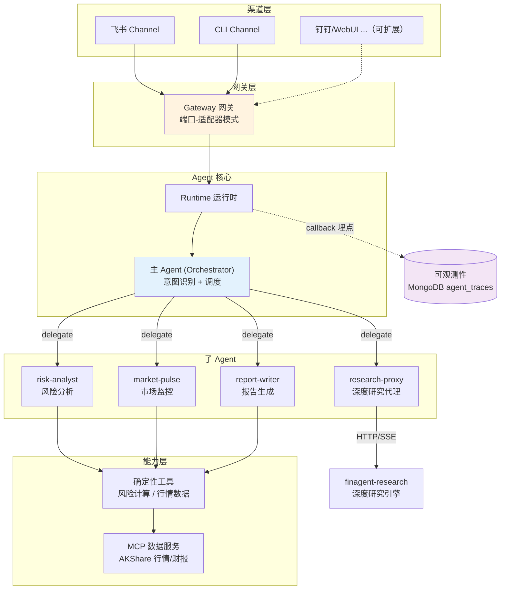

# FinAgent Core — 金融多 Agent 助手平台

> 一个部署在飞书上的金融 AI 助手：用自然语言做持仓风险分析、市场监控、报告生成、深度研究。
> 基于 LangGraph 多 Agent 架构，支持多渠道接入，自带全链路可观测性。

---

## 项目简介

FinAgent Core 是金融 AI 助手的**主入口与调度中枢**。用户在飞书里发一句话，系统通过"主 Agent + 子 Agent + 工具"的分层架构完成专业金融分析，并通过统一网关支持多平台接入。

它是 FinAgent 平台三个子项目之一，与 [finagent-research](../finagent-research)（深度研究引擎）集成。

**设计初衷**：作为有交易经验的开发者，我深知交易员/投研每天大量时间消耗在重复的信息处理上。本项目验证一个想法——交易员的"第二大脑"应该是一个真正懂业务的 AI Agent。

---

## 架构



**全链路示例**（一次飞书请求）：
```
飞书消息 → FeishuChannel → Gateway → Runtime → 主 Agent(判断意图)
→ 委派 risk-analyst → 风险工具(确定性算数字) → 大模型解读 → 合规报告 → 回飞书
（全程被可观测性 callback 捕获为调用树）
```

---

## 核心能力

| 能力 | 说明 | 触发示例 |
|---|---|---|
| 持仓风险分析 | 集中度、VaR/波动率、期货保证金/强平距离 | "帮我评估持仓风险" |
| 市场监控 | 大盘概览、涨跌家数、热点板块、个股行情 | "今天市场怎么样" |
| 报告生成 | 早盘简报、收盘复盘、持仓报告 | "给我一份早盘简报" |
| 深度研究 | 委派给 finagent-research，多 Agent 协作产出研报（异步） | "深度分析贵州茅台的投资价值" |

---

## 工程亮点

- **Agent-as-Tool 多 Agent 协作**：主 Agent 把子 Agent 包装成"委派工具"，新增专家只需注册一个工具，核心代码不动。
- **端口-适配器网关**：统一 `ChannelPlugin` 契约 + 标准化消息，一套 Agent 同时服务飞书/CLI，新增钉钉/WebUI 零侵入 Agent 核心（借鉴 OpenClaw 网关设计）。
- **确定性计算 + LLM 解读分离**：金融数字（VaR/保证金）由纯函数工具确定性计算，LLM 只负责把数字翻译成人话——避免大模型算错数，符合金融容错性要求。
- **合规内建**：所有输出禁止买卖建议、强制风险提示；深度研究引擎用对抗式审核自动拦截合规违规。
- **自研全链路可观测性**：基于 LangChain Callback 机制埋点，构建 trace/span 调用树，统一存储到 MongoDB，聚合出失败率、p95 延迟、Token 成本、失败分析。
- **跨服务集成**：通过 HTTP/SSE 调用独立的深度研究引擎，飞书侧采用"先回正在研究、完成后异步推送"的体验。
- **期货风险专长**：强平距离、保证金占用、跨品种方向性集中等期货专属风控指标。

---

## 技术栈

| 层 | 技术 |
|---|---|
| Agent 框架 | LangGraph（create_react_agent + Agent-as-Tool） |
| 大模型 | DeepSeek（OpenAI 兼容） |
| 数据工具 | FastMCP + AKShare（免费金融数据） |
| 渠道接入 | lark-oapi（飞书长连接） |
| 存储 | MongoDB（对话状态 + 追踪）/ Redis（缓存） |
| 可观测性 | LangChain BaseCallbackHandler + MongoDB 聚合 |

---

## 快速开始

```bash
# 1. 环境（需 MongoDB + Redis，见根目录环境部署教程）
python3 -m venv venv && source venv/bin/activate
pip install -r requirements.txt

# 2. 配置
cp .env.example .env        # 填 DEEPSEEK_API_KEY、FEISHU_APP_ID/SECRET 等

# 3. 启动飞书机器人
python run_feishu.py

# 4. 查看监控报表
python report_stats.py
```

也可本地命令行体验（无需飞书）：`python test_gateway_cli.py`

---

## 项目结构

```
src/
├── agent/           # 主 Agent、配置、记忆、子 Agent、工具
├── mcp_server/      # MCP 数据工具服务（行情/财报）
├── skills/finance/  # 风险分析技能（计算脚本 + 方法论）
├── gateway/         # 网关：契约 + 调度 + 渠道适配器(飞书/CLI)
└── observability/   # 可观测性：埋点 handler + 聚合指标
```

详见 [docs/项目结构说明.md](docs/项目结构说明.md)。

---

## Demo

> 在飞书里和机器人对话（截图占位，部署后补充）：
> - 持仓风险评估 → 返回集中度/VaR/期货强平距离分析
> - "今天市场怎么样" → 大盘概览 + 热点板块
> - "深度分析贵州茅台" → 先回"正在研究"，2-3 分钟后推送完整研报

---

## 声明

本项目为独立开发，借鉴公开的多 Agent 工程范式。所有 AI 输出仅供研究参考，不构成投资建议。
